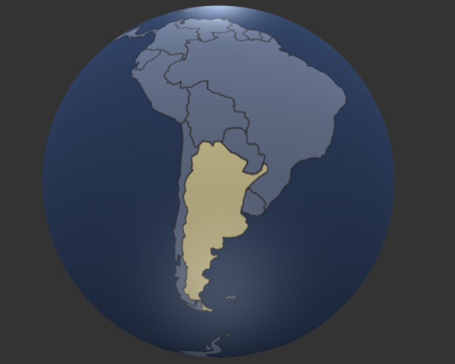
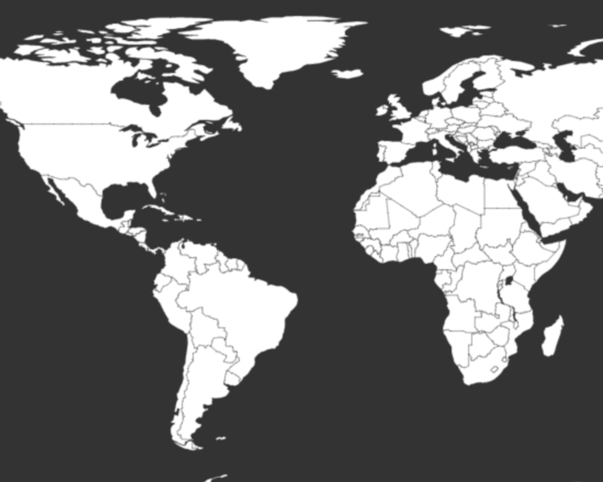
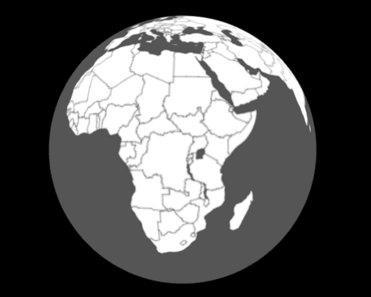
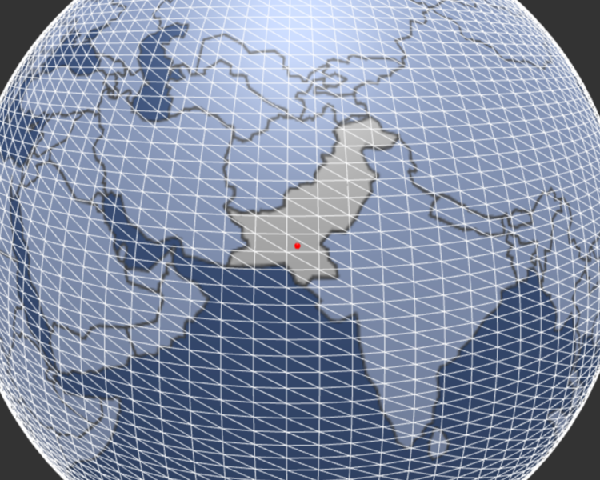

# webgl-globes


Demo interactive globes using THREE.js and D3.js.  Written entirely in ES6 modules.  The demos use SystemJS and Babel to load into the browser.


To run the demos, type npm install in the root folder to get the dependencies for the demos. Run a local server from the root folder.


```html
clone or copy the repo
cd into the folder
npm install
python -m SimpleHTTPServer 8000 (or your favorite local server)
```






